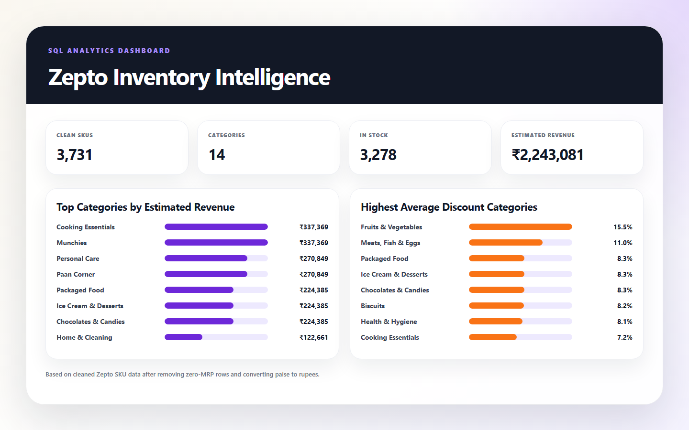
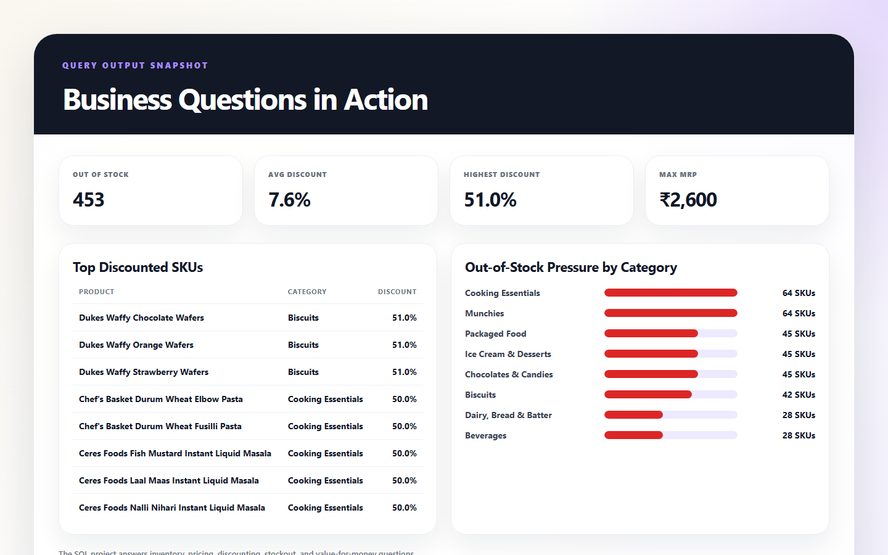

<div align="center">

# Zepto Inventory Intelligence

**SQL analytics on quick-commerce inventory, pricing, discounts, and stock availability**


</div>

## Overview

This project analyzes a Zepto inventory dataset using SQL-style business
questions: category performance, discount behavior, stock availability,
high-MRP products, and value-for-money opportunities.

The workflow follows a practical analyst path:

1. inspect raw SKU data,
2. clean pricing fields,
3. convert paise to rupees,
4. answer business questions with SQL,
5. summarize findings with visual evidence.

## Results Snapshot





## Key Findings

| Metric | Result |
|---|---:|
| Clean SKUs analyzed | 3,731 |
| Product categories | 14 |
| In-stock SKUs | 3,278 |
| Out-of-stock SKUs | 453 |
| Average discount | 7.6% |
| Highest discount | 51.0% |

## Business Questions Answered

- Which categories generate the highest estimated revenue?
- Which categories carry the most out-of-stock pressure?
- Which SKUs have the strongest discounts?
- Which high-MRP products have low discounting?
- Which categories offer the highest average discount?
- Which products provide the best price-per-gram value?

## Dataset

| Field | Details |
|---|---|
| Source | [Kaggle: Zepto Inventory Dataset](https://www.kaggle.com/datasets/palvinder2006/zepto-inventory-dataset/data?select=zepto_v2.csv) |
| File | `zepto_v2.csv` |
| Grain | One row per SKU |
| Size after cleaning | 3,731 SKUs |

## How to Run

### PostgreSQL analysis

1. Create a PostgreSQL database.
2. Run the table-creation section in `Zepto_SQL_data_analysis.sql`.
3. Import `zepto_v2.csv` into the `zepto` table.
4. Run the cleaning and analysis queries section by section.

### Regenerate report pages

```bash
python scripts/generate_readme_assets.py
```

The script reads `zepto_v2.csv`, applies the same cleaning assumptions, and
generates the visual report pages used to create the README screenshots.

## Project Files

```text
Zepto_SQL_data_analysis.sql   SQL schema, cleaning, and analysis queries
zepto_v2.csv                  Source inventory dataset
scripts/                      README asset generator
assets/                       Generated visual snapshots
```

## What This Demonstrates

- SQL data exploration and cleaning
- Inventory and pricing analysis
- Revenue estimation from SKU-level data
- Stockout and discount pattern analysis
- Clear communication of business insights
